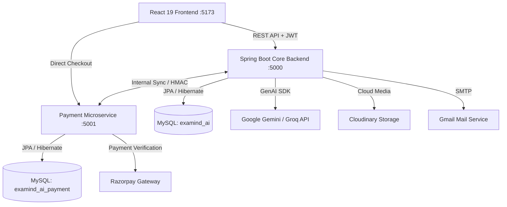

# 🎓 Examind AI — Next-Gen AI-Powered Examination & Proctoring Platform

[](https://www.oracle.com/java/)
[](https://spring.io/projects/spring-boot)
[](https://reactjs.org/)
[](https://vitejs.dev/)
[](https://tailwindcss.com/)
[](https://www.mysql.com/)
[](https://ai.google.dev/)
[](LICENSE)

> **Examind AI** is an enterprise-grade, full-stack examination ecosystem that combines modern web design with artificial intelligence. It features automated AI question generation, intelligent short-answer grading, robust client-side anti-cheat proctoring, dynamic negative marking, live analytics, and an integrated microservice for Razorpay payments.

---

## 🌟 Key Features

### 👨‍🎓 For Students
- **Distraction-Free Exam Interface:** Real-time countdown timers, question palette navigation, question flagging, and auto-submit upon timer expiry.
- **Smart Result Analytics:** Instant scorecards, percentage calculation, section-wise breakdown, and automated performance badges.
- **AI Coach & Revision Mode:** Personalized weak-area detection and custom revision attempts generated from previously missed or incorrect questions.
- **Automated Certification:** Downloadable PDF certificates upon achieving configurable passing thresholds.
- **Proctoring Integrity:** Transparent warning alerts for tab switching, fullscreen exits, or unauthorized shortcuts.

### 👩‍🏫 For Faculty & Instructors
- **AI-Powered Question Generator:** Generate high-quality multiple choice, multi-select, and short-answer questions instantly using Google Gemini and Groq AI models.
- **Bulk Import via Excel:** Upload hundreds of questions in seconds using structured spreadsheet templates.
- **Granular Anti-Cheat Settings:** Configure tab-switch limits, fullscreen enforcement, right-click disabling, and copy-paste blocking per quiz.
- **Student Performance Matrix:** Track individual attempts, review proctoring recordings, and manually override AI short-answer grades.

### 🛡️ For Administrators
- **Comprehensive Dashboard:** Real-time statistics on total exams, active users, pass rates, and system revenue.
- **User Role Management:** Granular Role-Based Access Control (RBAC) separating `student`, `faculty`, and `admin` privileges.
- **Payment & Subscription Ledger:** Monitor student fee transactions and pass purchases powered by Razorpay.

---

## 🏗️ System Architecture

Examind AI employs a hybrid decoupled architecture: a Spring Boot core monolith service, a standalone payment microservice, and a modern single-page frontend.



---

## 💻 Tech Stack

| Tier | Technologies |
| :--- | :--- |
| **Frontend** | React 19, Vite, Tailwind CSS, Lucide Icons, Canvas Confetti, Axios |
| **Core Backend** | Java 17, Spring Boot 3, Spring Security, JWT (JJWT), Spring Data JPA, Hibernate, Apache POI |
| **Payment Microservice** | Spring Boot 3, Razorpay Java SDK, HMAC-SHA256 Security, Spring Data JPA |
| **Databases** | MySQL 8.0 (Dedicated schemas for isolation) |
| **AI & Media** | Google Gemini 1.5, Groq Llama 3, Cloudinary CDN |

---

## 🚀 Getting Started Locally

### 1. Prerequisites
- **Java Development Kit (JDK):** Version 17 or higher
- **Node.js:** Version 18.x or higher
- **MySQL Server:** Version 8.0 or higher

---

### 2. Database Setup
Create two separate MySQL databases (or let Spring Boot create them automatically):
```sql
CREATE DATABASE IF NOT EXISTS examind_ai;
CREATE DATABASE IF NOT EXISTS examind_ai_payment;
```

---

### 3. Environment Configuration
Copy `.env.example` in the root folder and set your credentials:
```bash
cp .env.example .env
```
*(Note: Active development files `application-local.properties` and `.env` are automatically ignored by Git).*

---

### 4. Running the Backend Services

#### Terminal 1: Core Backend (`:5000`)
```bash
cd backend
mvn spring-boot:run
```
*Runs at `http://localhost:5000/api`*

#### Terminal 2: Payment Service (`:5001`)
```bash
cd payment-service
mvn spring-boot:run
```
*Runs at `http://localhost:5001/api`*

---

### 5. Running the Frontend (`:5173`)
```bash
cd frontend
npm install
npm run dev
```
*Access the user interface at `http://localhost:5173`*

---

## 🔑 Default Seed Accounts

The platform automatically seeds initial administrative and demo accounts on first startup:

| Role | Email | Password | Access Level |
| :--- | :--- | :--- | :--- |
| **Admin** | `admin@examind.ai` | `admin@123` | Full administrative controls, user management & system settings |
| **Faculty** | `faculty@examind.ai` | `faculty@123` | Quiz creation, AI question generator & grading |
| **Student** | `student@examind.ai` | `student@123` | Taking exams, revision modes & scorecards |

---

## 🔒 Security & Integrity Architecture

- **Answer Protection:** Student exam endpoints sanitize question objects, completely masking correct options and explanations until completion.
- **Tamper-Proof Payments:** All Razorpay webhook events and client responses enforce strict server-side HMAC-SHA256 signature verification.
- **Brute-Force & Rate Limiting:** Registration OTPs utilize cryptographically secure `SecureRandom`, a maximum 5-attempt threshold, and a 60-second resend cooldown.
- **Exception Sanitization:** Global exception handlers filter raw SQL traces and database column metadata, protecting system internals from client disclosure.

---

## 📄 License
This project is open-source and available under the [MIT License](LICENSE).
